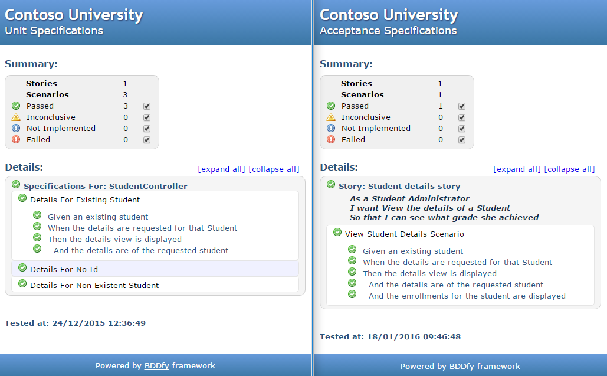

## What is Specify?
Specify is a BDD-style testing library for .Net that builds on top of BDDfy from [TestStack](http://www.teststack.net/). While BDDfy is primarily intended for BDD testing, it is beautifully designed to be very easy to customize and extend. Specify provides base test fixtures that extend BDDfy with support for containers - both Inversion of Control (IoC) containers and auto mocking containers - which act as a SUT factory to automatically create the SUT (System Under Test) and other dependencies.

## Works with your unit test framework
Specify works with the main .Net unit testing frameworks (and probably others not tested against such as mbunit) by simply wiring it up in one place:

- NUnit
- xUnit
- MsTest
- Fixie

## Consistent style for all test types
All tests (or specifications) are written as a class per scenario in the familiar Given When Then style. 

    public class DetailsForNonExistentStudent : ScenarioFor<StudentController>
    {
        ActionResult _result;

        public void Given_a_student_does_not_exist()
        {
            Container.Get<IStudentRepository>()
                .FindById(Arg.Any<int>())
                .Returns((Student)null);
        }

        public void When_the_student_details_are_requested()
        {
            _result = SUT.Details(10);
        }

        public void Then_HttpNotFound_is_returned()
        {
            _result.Should().BeOfType<HttpNotFoundResult>();
        }
    }

Simply inherit from the ScenarioFor base fixture. Note, there are no test framework attributes such as [Test] or [Fact]. Your test framework is wired up in one place and then all of 

## Consistent reporting for all test types
If you've come across TestStack.BDDfy, you will already know about its awesome reports. Why not have the same great reports for your other types of .Net tests?

The BDD report on the right groups specifications with the typical BDD user story, whereas the unit test report on the left groups specifications by the System Under Test.

## Works with your Inversion of Control container
Specify uses TinyIoc under the covers and provides a plugin for Autofac, with a plugin for Ninject hopefully available soon. You can also write a custom adapter for other IoC containers and plug them in to Specify.

## Works with your mocking container
There is transparent built-in support for [NSubstitute](http://nsubstitute.github.io/), [Moq](https://github.com/Moq/moq4), and [FakeItEasy](http://fakeiteasy.github.io/) auto-mocking containers. Just add a reference to one of these projects and Specify will detect it and use the relevant adapter. You can also write a custom adapter for other mocking containers and plug them in to Specify.